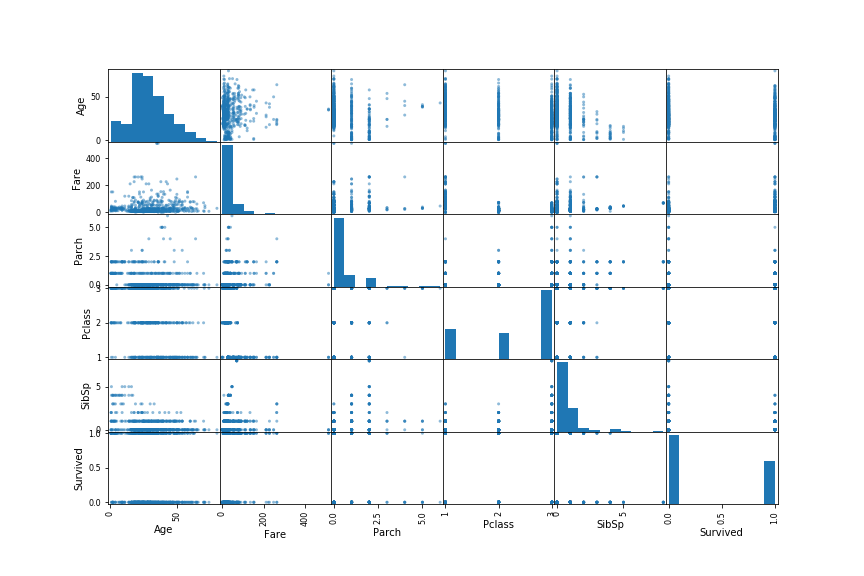
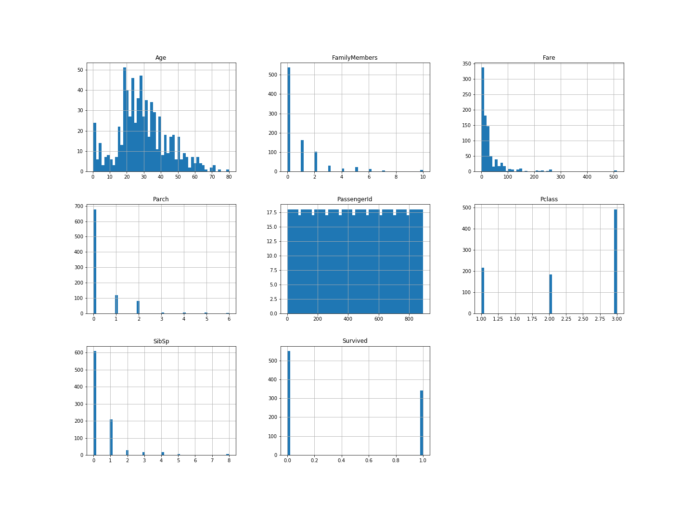

# Lab Notebook

## 2020-04-04 Exploratory Analysis of the Data

### Findings

There are 891 observations.  Some data is missing for 'age' and 'cabin'.  The overall survival rate is 38%.  Mean age of all passengers is 30.  The Fare and SibSp variables exhibit significant positive skew.  The Fare and Pclass have the highest correlations with the survived variable.

#### Correlation Matrix



#### Histogram  

 

### Interpretations

* Since Fare and Pclass have the highest correlations with survived, they will likely be the most useful variables in predicting who survives.  

### Next Steps

* We will need to decide what to do with missing age and cabin data.  Since so much of the cabin data is missing, we might need to throw that variable out.  For age we can likely start by imputing missing data with the median age.
* Will likely need to convert the Pclass and Survived variables from numeric to categorical variables.
* SibSp, Parch could either be modeled at categorical or numeric data.
* If I were to build a first model, I would likely want to try out a multiple regression model.


##2020-04-19

### Problem Framing

* I am providing evidence regarding characteristics associated survival to a historian writing a book.  This indicates to me that the model does not need to be extremely accurate at predicting survival on an individual basis.  Rather it is more important to develop a model that is interpretable, and predicts survival reasonably well.
* The author will use my model to develop a narrative describing the types of people that survived the Titanic and why.
* We already know who survived and who perished.  It is more important to discover why individuals survived or perished.
* This is a supervised learning problem; the data is labeled.
* This is an offline model.  The model will be trained with batch data.
* Model performance will be measured by the area under the receiver operating characteristic (ROC) curve.  This measure of performance does incentivize a more predictive model, but it won't incentivize me to build an explainable one.
* Comparable problems include any other classification-type problems.
* I can likely reuse some pre-processing code from previous projects.
* I do not have access to any human expertise from a historian on this problem.
* If I were to solve this problem manually, I would calculate the average survival rate by characteristic.  Then use that to guide the historian's narrative.
* Assumptions:
  * Data quality is a minor to non-existent issue.  I'm assuming that all of the survival classifications are correct.

### Experiment Plan

I plan on building quick Logistic Regression and Bayes Naive Classifier models to set baseline model predictions.  Both the models and the pre-processing pipelines will be very simple.  Neither will include any feature engineering.

### Logistic Regression Pre-processing and Model Decisions

* I decided to throw out the following variables: Name, Ticket, and Cabin.  I don't think Name or Ticket will have much predictive value.  There is a lot of missing data for the Cabin variable.

* Missing categorical data was imputed with the most frequent values.

* I encoded categorical variables as dummy variables.

* Missing numeric data was imputed with median values.

* The Logistic Regression model parameters were:

  ```python
  LogisticRegression(C=1.0, class_weight=None, dual=False, fit_intercept=True,
                     intercept_scaling=1, l1_ratio=None, max_iter=1000,
                     multi_class='auto', n_jobs=None, penalty='none',
                     random_state=94, solver='lbfgs', tol=0.0001, verbose=0,
                     warm_start=False)
  ```

* I set the ```penalty``` parameter to ```"none"```, turning off any regularization.

* I got a convergence warning on the first run, so I upped the ```max_iter``` parameter to ```1000```.

* I used a 10-fold cross validation design with the default scoring technique: "predict_proba".  From there I could compute all the necessary metrics.

### Logistic Regression Results and Interpretation

| Metric              | Value                                                        |
| ------------------- | ------------------------------------------------------------ |
| Precision           | 0.7438271604938271                                           |
| Recall              | 0.7046783625730995                                           |
| Area Under Curve    | 0.8491675454574507                                           |
| Accuracy              | 0.7934904601571269                                           |


The baseline Logistic Regression model was able to predict whether an individual would survive or not 79% of the time.  The model is a significant improvement over the 38% base rate of survival.  However, since this is a very simple model, there may be room for improvement still.

### Next Steps

In the next iteration of this model, I would like to experiment with L1 and L2 regularization.  That means that I will also need to scale the numeric features in my pre-processing pipeline.  Additionally, I would like to vary the amount of regularization using the ```C``` parameter.


## 2020-04-22

### Experiment Plan

Build a simple baseline Bayes Naive Classifier model.  Compare the results to your simple logistic regression model.

### Bayes Naive Classifier Pre-processing and Modeling Decisions

* I decided to throw out the following variables: Name, Ticket, and Cabin.  I don't think Name or Ticket will have much predictive value.  There is a lot of missing data for the Cabin variable.
* Missing categorical data was imputed with the most frequent values.
* I encoded categorical variables as numbers with an Ordinal Encoder.
* Missing numeric data was imputed with median values.
* I choose to use a GaussianNB model.
* I used a 10-fold cross validation design with the default scoring technique: "predict_proba".  From there I could compute all the necessary metrics.

### Bayes Naive Classifier Results and Interpretation

| Metric           | Value              |
| ---------------- | ------------------ |
| Precision        | 0.7196531791907514 |
| Recall           | 0.7280701754385965 |
| Area Under Curve | 0.8313733635850404 |
| Accuracy         | 0.7867564534231201 |


The simple Naive Bayes model performs remarkably similar to the simple Logistic Regression model.

Submitting this model to Kaggle resulted in a score of 0.75598 (https://www.kaggle.com/brianelinsky) (Account User ID 4810027)

### Next Steps

* If I decide to improve on this model, I could use a normal scaler on the features.  The Naive Bayes model assumes the data is normally distributed, so this might improve the performance.

## 2020-04-23

### Experiment Plan

I plan on implementing a more complex logistic regression model.   I'll experiment with L1 and L2 regularization.  In pre-processing, I'll need to scale the numeric features.  I'll find the optimal amount of regularization using a grid search.


### Logistic Regression Pre-processing and Modeling Decisions

* I retained most of the pipeline from my first logistic regression model.

* I added a RobustScaler to the numeric pipeline.

* I decided to vary the following parameters in a grid search.

* The grid search will use 10-fold cross validation.

* The grid search will use a ROC_AUC scoring method.

* The logistic regression model parameters were:

  ```python
  LogisticRegression(C=0.1, class_weight=None, dual=False, fit_intercept=True,
                     intercept_scaling=1, l1_ratio=None, max_iter=100,
                     multi_class='auto', n_jobs=None, penalty='l2',
                     random_state=None, solver='liblinear', tol=0.0001, verbose=0,
                     warm_start=False)
  ```

### Logistic Regression Results and Interpretation

| Metric           | Value              |
| ---------------- | ------------------ |
| Precision        | 0.7580645161290323 |
| Recall           | 0.6871345029239766 |
| Area Under Curve | 0.8313733635850404 |
| Accuracy         | 0.7867564534231201 |


Adding in regularization did not substantially impact the results.  Precision, accuracy, and AUC increased, while recall decreased.  Overall the model is slightly better, but with added complexity.

If you look at the learning curve for this model, most of the learning is completed over about the first 230 training examples.  After the training score and cross-validation score have converged, additional examples provide no learning benefit.  This indicates to me that the model suffers from a bias problem, not a variance problem.  Adding more training examples won't make the model better.  Rather, I'll need to add complexity to the model to improve it.  I could do this by using a different model (that has more degrees of freedom), or by engaging in some feature engineering.

Submitting this model to Kaggle resulted in a score of 0.76555 (https://www.kaggle.com/brianelinsky) (Account User ID 4810027)

### Next Steps

This is a pretty popular dataset.  From here, I could look at models that others have built, and see what sorts of pre-processing they are employing.  I think that most of the improvements to this model will likely be achieved with better feature processing and engineering.